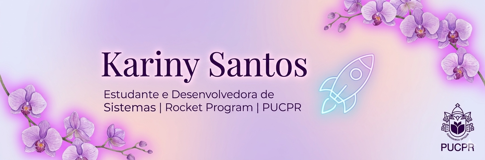

 

---

> Repositório dedicado ao registro de aprendizado e projetos práticos no **Rocket Program**. Aqui, transformo teoria em código! 💻✨

## 🚀 Projetos em Destaque

| Projeto | Descrição | Status | Tech |
| :--- | :--- | :--- | :--- |
| [BadIdeaDex](https://github.com/KaSantosAlpar/Rocket-Program/tree/projeto-dex) | Pokedex de ideias com roleta e interface Neon. | Versão 1.0 | JS / Neon |
| [Super Mario Bros](https://github.com/KaSantosAlpar/Rocket-Program/tree/projeto-mario) | Landing page com Iframe API e Bootstrap 5. | Versão 1.0 | BS5 / API |
| [Tech & Coffee](https://kasantosalpar.github.io/Rocket-Program/02-html-css-bootstrap/) | Site completo com estética minimalista  | Versão 1.0 | CSS / Flex |

---

## 📂 Trilha de Evolução

### 🎨 Front-end & Design
* **Módulo 02:** [HTML, CSS e Bootstrap](./02-html-css-bootstrap/)
  * *Destaques:* Cartão de Perfil Profissional e Portfólio Pessoal.

### 🧠 Lógica & Core
* **Módulo 01:** [JavaScript Básico](./01-javascript-basico/)
  * *Destaques:* CRUD, Bhaskara e Jogo de Adivinhação.

---

## 📊 Estatísticas

---
*“A melhor forma de prever o futuro é inventando-o.” – Alan Kay*